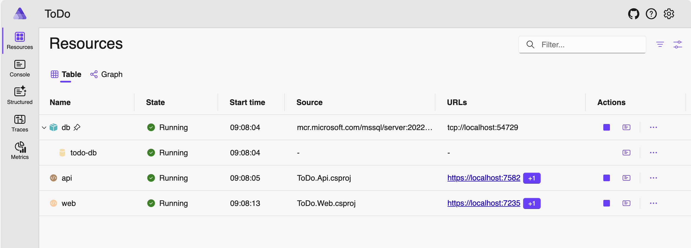
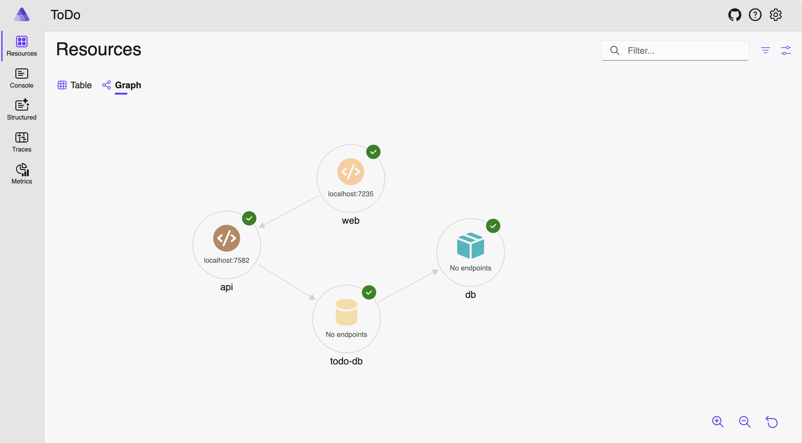
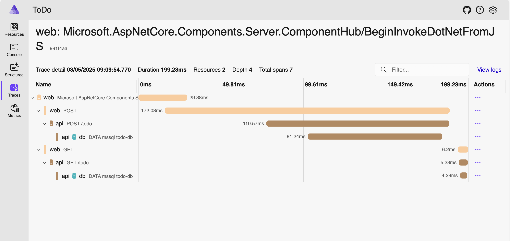

# ToDo App Series

This repository is a tutorial project for my blogging site. It will eventually become one of my first YouTube series on getting started with C# coding using Blazor with Aspire.

## Prerequisites

- [.NET 9 SDK (latest)](https://dotnet.microsoft.com/download/dotnet/9.0)
- [Docker](https://www.docker.com/get-started)

## Aspire

This project uses [Aspire](https://learn.microsoft.com/en-us/dotnet/aspire/), a .NET stack for building cloud-native applications. Aspire provides a dashboard for managing and visualizing your application's resources, dependencies, and diagnostics.

Read more about why you should try Aspire on my blog: [Why You Should Try Aspire](https://intrepid-developer.com/blog/why-you-should-try-aspire)

Below are some screenshots of the Aspire dashboard in action with this project:

### Aspire Resource Table

### Aspire Resource Graph

### Aspire Trace View

## Running the Project

1. Ensure you have the latest .NET 9 SDK and Docker installed.
2. Open the solution (`.sln`) file in your preferred IDE (such as Visual Studio or VS Code).
3. Locate the `AppHost` aspire project within the solution.
4. Run the `AppHost` project to start up the application and its dependencies.

---
Happy coding!